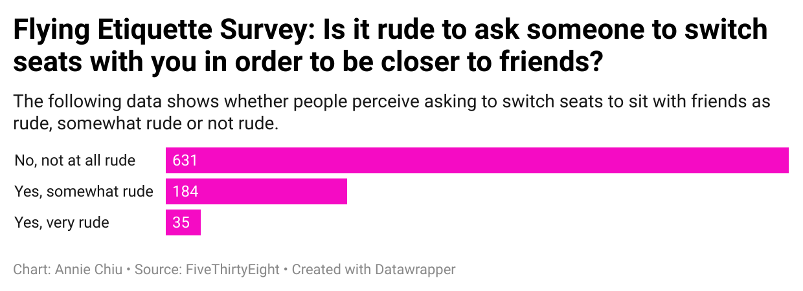

# journ124-wk4

I chose the question, " Is it rude to ask someone to switch seats with you in order to be closer to friends?" because I do this when I fly with my friends and wonder if people generally think this is rude. 

It was interesting to see that there was an overwhelming amount of people who think it is not rude to ask compared to people who did. 

My chart reveals that majority of people in the data set do not find it rude when people ask to switch seats to sit with their friends.

This is a chart I made to visualize the data. 

